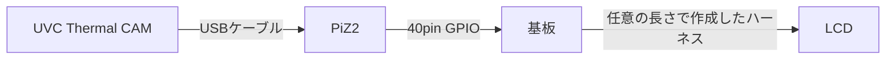

# **【WIP】**

# 夢ビジョン サーマルフュージョンプログラム "Day Dream"
本プログラムおよび基板は特定のナイトビジョンカメラにサーマル映像を合成するための装備一式を作成するためのものである。

本装置を作成するにあたり、はんだ付け,圧着,CUI操作といった作業を実施する必要がある。

## 必要な工程
|番号|工程|備考|
| --- | --- | --- |
|1|部材の調達|AmazonやAliexpressを使用|
|2|基板の作成|JLCPCBなどに発注後、基板をはんだ付け|
|3|ハーネス作成|自作や発注|
|4|環境構築と動作確認|仮組み|
|5|組み立て|作成したナイトビジョンユニットへの組み込み|
|6|投影位置調整|ナイトビジョンユニットの映像と投影位置を合致させる|

## 必要な機材
必要な特殊工具は別途記載してあるが、汎用工具は一切記載していないので注意のこと。
|部材名称|説明|備考|
| --- | --- | --- |
|サーマルユニット|UVC対応の解像度が256x192の物|InfiRay P2Pro及びHikmicro mini2にて動作確認済み|
|USBケーブル|Type-Cメス-MicroBオス|OTG対応のもの|
|基板|今回作成したもの|後述|
|Raspberry Pi Zero 2 W|サーマルユニットのメイン処理装置|高価で大きくても良いならPi4Bでも良い|
|ハーネス|今回作成したもの|後述|
|液晶モニタ|サーマル画像投影用|1.54インチ 240x240  ドライブICはST7789|
|コネクタかしめ工具|ハーネス作成用|XHコネクタ対応のもの|
|はんだ付けセット|基板制作用|2.54mmピッチのはんだ付けなのでなんでもよい|

> [!TIP]
> mini2とP2Proの違いについて
> 
> mini2
>   - 256x196で生画像を取得可能、256x192で正規化済の画像を取得可能
>   - アウトライン表示の場合、20fpsへ処理を落とす事で処理落ちに対応
>   - FOV(deg):50.0x37.2
>   - SIZE(mm):42x22.5x11.2
>
> P2Pro
> - 256x192で正規化済の画像を取得可能、256x384で正規化済の画像+生画像を取得可能
> - アウトライン表示で25fps出力が可能
> - FOV(deg):56.0x42.2
> - SIZE(mm):27x18x9.8

## 基板の作成
配布しているガーバデータとドリルデータを使用し発注後、部品をはんだ付けする。
必要な部材は下記の通りである。
|部材名称|個数|型式|
| --- | --- | --- |
|タクトスイッチ|6|DTS63NV|
|DIPスイッチ 3P|1|KSD32|
|XHコネクタ|1|S10B-XH-A|
|ピンソケット2x20|1|FH-2x20SG|
|連結ピンソケット|1|MFH2X20SG-2|

## ハーネスの作成
LCDと基板を接続するハーネスを作成する。
必要な部材は下記の通りである。

|部材名称|個数|型式|
| --- | --- | --- |
|XHコネクタ(LCD用)|1|S8B-XH-A|
|XHハウジング 8P|1|XHP-8|
|XHハウジング 10P|1|XHP-10|
|XHハウジング用コンタクト|18|SXH-001T-P0.6C|
|ハーネスケーブル|1|KRT AWG28 X 8C|

番号はハウジングの突起を上にしてケーブルから見て左から1,2,3...である。

**LCD側**
|番号|説明|
| --- | --- |
|1|BL|
|2|CS|
|3|DC|
|4|RST|
|5|SDA|
|6|SCL|
|7|VCC|
|8|GND|

**基板側**
|番号|説明|
| --- | --- |
|1|N.C.|
|2|VCC|
|3|SDA|
|4|N.C.|
|5|SCL|
|6|GND,CS|
|7|N.C.|
|8|RST|
|9|DC|
|10|BL|

## 環境構築
Raspberry Pi ZERO2で実行する為、極力無駄を省いたDietPiを使用する。
SDカードに書き込み後、

## 投影位置調整

