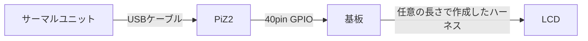

# サーマルフュージョンシステム "Day Dream"
## はじめに
本プログラムおよび基板は出力に1.54インチのディスプレイを備えた中国製の激安ナイトビジョンカメラにサーマル映像を合成するための装備一式を作成するためのものである。  
既存のナイトビジョンにハーフミラーを使用して映像を合成し、可視光帯と近赤外帯に加えて熱赤外帯を同時に見ることが出来る(実物と比較して)安価なデバイスを目指した。
最初期のプロトタイプでは自作のハーフミラーを使用していたが、あまりにも手間がかかるためこれまた中国製のビームスプリッターに代替した。アリエク様々である  


 

最初の試作品  

一般的なイメージセンサを使用したナイトビジョンでは赤外線フィルタを取り外しても光の増幅量には限度があり、赤外線ライトを使用する必要がある。  
そこで、サーマルセンサと映像を合成することで完全な暗所におけるIRライトを使用しない行動能力の獲得や暗所での熱源(ヒト、動物など)の特定能力の獲得を図った。  対象ナイトビジョンについてや、筐体のデータに関してはQoo622氏の以下のリポジトリを参照のこと。  
https://github.com/Qoo622/3D-print/tree/master/Yume-Vision/YUME_v1/DayDream


通常  
  
サーマル画面と輪郭検出  

  

## 概要
本装置を作成するにあたり、はんだ付け,圧着,Linux上でのCUI操作といった作業を実施する必要がある。  
また再現する人が出てこないと踏んでいるため、かなりの部分を省いて記載している。  
詳細が必要であれば何かしらでご連絡ください。  

## 必要な工程
|番号|工程|備考|
| --- | --- | --- |
|1|部材の調達|AmazonやAliexpressを使用|
|2|基板の作成|JLCPCBなどに発注後、基板をはんだ付け|
|3|ハーネス作成|自作や発注|
|4|環境構築と動作確認|仮組み|
|5|組み立て|作成したナイトビジョンユニットへの組み込み|
|6|投影位置調整|ナイトビジョンユニットの映像と投影位置を合致させる|

## 必要な機材
必要な特殊工具は別途記載してあるが、汎用工具は一切記載していないので注意のこと。  
|部材名称|説明|備考|
| --- | --- | --- |
|サーマルユニット|UVC対応の解像度が256x192の物|InfiRay P2Pro及びHikmicro mini2にて動作確認済み|
|USBケーブル|Type-Cメス-MicroBオス|OTG対応のもの、途中で変換してもよい|
|基板|今回作成したもの|後述|
|Raspberry Pi Zero 2 W|サーマルユニットのメイン処理装置|高価で大きいがPi4Bでもよい、Pi5は未対応|
|Raspberry Pi Zero 2 W用ヒートシンク|オーバークロックを実施するため必須|チップに貼り付けるものではなく大型のものが良い|
|ハーネス|今回作成したもの|後述|
|液晶モニタ|サーマル画像投影用|1.54インチ 240x240  ドライブICはST7789|
|コネクタかしめ工具|ハーネス作成用|XHコネクタ対応のもの|
|はんだ付けセット|基板制作用|2.54mmピッチのはんだ付けなのでなんでもよい|




> [!TIP]
> mini2とP2Proの違いについて  
>   
> mini2
>   - 256x196で生画像を取得可能、256x192で正規化済の画像を取得可能
>   - アウトライン表示の場合、20fpsへ処理を落とす事で処理落ちに対応
>   - FOV(deg):50.0x37.2
>   - SIZE(mm):42x22.5x11.2
>
> P2Pro
> - 256x192で正規化済の画像を取得可能、256x384で正規化済の画像+生画像を取得可能
> - アウトライン表示で25fps出力が可能
> - FOV(deg):56.0x42.2
> - SIZE(mm):27x18x9.8

## 基板の作成
配布しているガーバデータとドリルデータを使用し発注後、部品をはんだ付けする。  
必要な部材は下記の通りである。  
秋月電子で全て揃う。  
|部材名称|個数|型式|
| --- | --- | --- |
|タクトスイッチ|6|DTS63NV|
|DIPスイッチ 3P|1|KSD32|
|XHコネクタ|1|S10B-XH-A|
|ピンソケット2x20|1|FH-2x20SG|
|連結ピンソケット|1|MFH2X20SG-2|


## ハーネスの作成
LCDと基板を接続するハーネスを作成する。  


左から1,2,3……と数える。例えば上図の赤色の線は2であるためVCCとなる。  
ハーネスの長さはおそらく6,70cmが限度だと思われるので注意すること。  
必要な部材は下記の通りである。  
|部材名称|個数|型式|
| --- | --- | --- |
|XHコネクタ(LCD用)|1|S8B-XH-A|
|XHハウジング 8P|1|XHP-8|
|XHハウジング 10P|1|XHP-10|
|XHハウジング用コンタクト|18|SXH-001T-P0.6C|
|ハーネスケーブル|1|KRT AWG28 X 8C|

番号はハウジングの突起を上にしてケーブルから見て左から1,2,3...である。

**基板側**
|番号|説明|
| --- | --- |
|1|N.C.|
|2|VCC|
|3|SDA|
|4|N.C.|
|5|SCL|
|6|GND,CS|
|7|N.C.|
|8|RST|
|9|DC|
|10|BL|

**LCD側**
|番号|説明|
| --- | --- |
|1|BL|
|2|CS|
|3|DC|
|4|RST|
|5|SDA|
|6|SCL|
|7|VCC|
|8|GND|


## 環境構築
Raspberry Pi ZERO2で実行する為、極力無駄を省いたDietPiを使用する。  
OSデータをPCにて書き込み後、RPiZ2を無線LANに接続し、RPiZ2上で作業を実施する。

### オーバークロック
dietpi-configからPerformance Optionに入りOverclockingを選択、highを選択する。  
また、CPU Governorを選択しperformanceを選択する。

### パッケージのインストール
オーバークロックの設定後、dietPi-Softwareを使用して以下のパッケージを導入する。  

|パッケージ番号|説明|
| --- | --- |
|7|FFmpeg|
|69|Python 3 RPi.GPIO|
|130|Python 3|

また、aptコマンドで以下のパッケージをインストールする。  

|パッケージ名|説明|
| --- | --- |
|python3-opencv|取得画像の操作に使用|
|python3-numpy|取得画像の操作に使用|
|python3-pip|多分インストール済|
|python3-spidev|多分インストール済|

pipコマンドでST7789のパッケージをインストールする。  
~~面倒~~これしか使わないのでbreak-system-packagesを使っている。  

`pip3 install --break-system-packages st7789`

### ファイルのコピー
適当な場所にファイル一式をコピーする。  
本書の中では/root/yume/以下にすべて格納している体で記載している。  

|ファイル名|説明|
| --- | --- |
|mov.py|オープニングアニメーション用、OSの起動後安定するまでの尺稼ぎ要素が強い|
|mov.mp4|オープニングアニメーション本体|
|mini2.py|HIKMICRO mini2用アプリケーション|
|mini2_contours_Xfps.py|mini2用アウトラインアプリケーション|
|P2pro.py|Infiray P2 Pro用アプリケーション|
|P2pro_contours.py|P2 Pro用アウトラインアプリケーション|

### シャットダウンボタンの設定
Raspberry Piは実行中に電源を落とすと起動不能になるため、電源ボタンを設ける必要がある。
そのため、基板上のPowerボタンを3秒間押し続けると自動でシャットダウンを実施させるために/boot/config.txtを編集し最終行に以下を加える。

`dtoverlay=gpio-shutdonw,gpio_pin=2,debounce=3000`

### 自動起動設定
RPi上でUVCカメラとしてサーマルユニットを使用する時、uvcvideoドライバをquirks=0x02でロードする必要がある。  
`dietpi-autostart`を実行し、14番のCustom script(background~)を選択後以下の内容を書き加える  
mov.pyとtactrun.pyは実際にファイルを置いた場所を指定すること。  
```
sudo sh -c "echo -n\"1-1\" > /sys/bus/usb/drivers/usb/unbind"
sleep 1
sudo rmmod -f uvcvideo
sleep 1
sudo modprobe uvcvideo quirks=2
sleep 1
sudo sh -c "echo -n\"1-1\" > /sys/bus/usb/drivers/usb/bind"
sleep 1
python3 /root/yume/mov.py
sleep 1
nohup python3 /root/yume/tactrun.py &
```

また、P2Proを使用する場合、tactrun.pyのmini2を指定している箇所を書き換えること。
```
if button1 == False and button2 == True:
    cmd = "python3 /root/yume/mini2.py"
if button1 == False and button2 == False:
    cmd = "python3 /root/yume/mini2_contours_Xfps.py"
```

## 動作確認
全ての環境構築が完了したらナイトビジョンユニットへ組み込む前に動作確認を実施する。
USBケーブルでサーマルカメラと接続し、基板をRPiZ2へ接続、ハーネスで基板とLCDを接続後に電源を投入する。

|ボタン名|説明|
| --- | --- |
|Power|3秒間押し続けることでシャットダウンを実行|
|App|サーマルプログラムを実行(シャットダウン後に押すとRPiZ2が起動する)|
|Power+App|アウトラインプログラムを実行|
|EXIT App|実行中のプログラムを終了|
|RGB DIPスイッチ|画面の色が変わる、すべてOFFだと画面が点灯しないので注意|
|brightness|左側を押すと暗くなり、右側を押すと明るくなる|
|White Black|サーマル画像の白黒反転|

電源投入後、オープニングアニメーション終了後に基板のAppボタンを押下すると通常のサーマル画面が起動する。
Powerボタンを押しながらAppボタンを押下すると輪郭抽出画面が起動する。


## 投影位置調整
組み立て後、ナイトビジョン映像とサーマル映像の位置合わせを実施する必要がある。  
サーマル側の投影位置およびサイズの調整はソースコード内の以下の場所で実施している。  
```
image = cv2.copyMakeBorder(image,15,60,45,90, cv2.BORDER_CONSTANT, value=[0,0,0])    
                                  ↑  ↑  ↑  ↑                                       
```

256x192のサーマル画像を取得後、上記箇所にて余白を上下左右に追加して後段の処理で240x240に圧縮している。
余白の量を増減させ、ナイトビジョンの映像に合わせる。
この数値はナイトビジョンに取り付けてあるレンズや、カメラとサーマルユニットの光軸ズレで個々に異なる。
ある程度の距離の壁に貼るカイロを設置して左上角と右下角の位置を合わせるように調整すると良い。


## 現在の問題点と今後の予定
- 映像の取得やLCDへの送信をマルチスレッド化して処理時間に余裕を持たせたい。
    - 現状は実行時間がかなりカツカツ
    - そもそもPythonが遅いのでC言語で作り直したい。
- 実行時間に余裕ができたら磁力センサを乗せてHUD表示なんかも楽しそう。
- ESP32あたりに移植出来ないものか……しかしアレはOpenCVが走らない……。
- 280x240の液晶を使用しドットバイドット表示したレールマウントなサーマルデバイスの作成、したいね。


